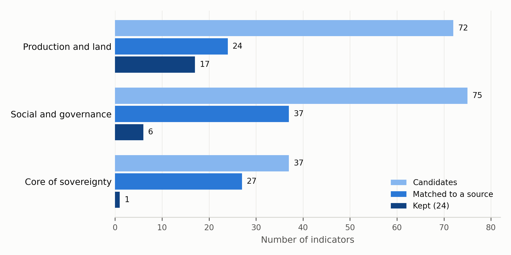
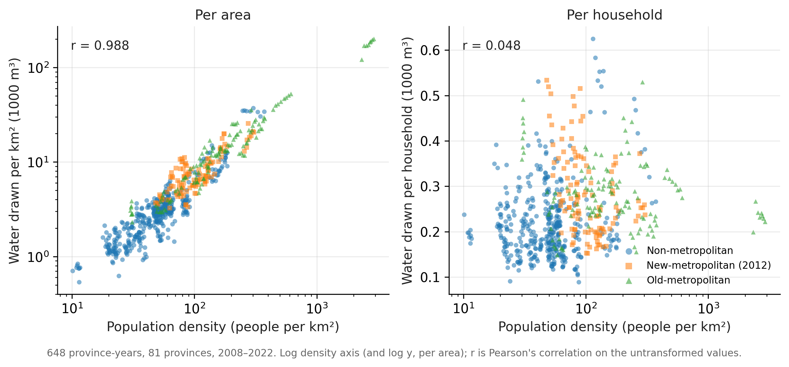
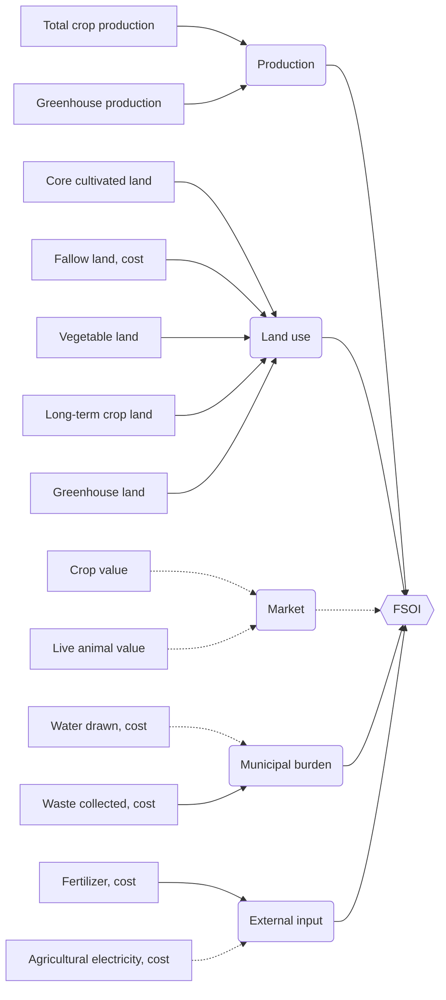

# 4. Measuring Food Sovereignty with Official Statistics

<!--
WORKING DRAFT v1 (complete), agent-written for Orhan to rewrite. Markers:
  [INT]     an interpretation: accept, rewrite or reject
  [CITE: x] a citation you supply from your own reading; never cite unverified
  [VERIFY]  a fact to confirm against its source before keeping
  [FIGURE]  a figure still to produce
Ledger rows used: A5–A6, B1–B24, C5, E9–E11 (claims_ledger.md).
Search details: literature_research/ReadMe.md. Table 4.1: writing_drafts/scripts/attrition_table.py.
-->

This chapter describes how I turned food sovereignty, a concept about control, into a
measurable index built from official Turkish statistics. It has three parts. Section 4.1
follows the indicators from theory to data: what the concept asks for, what Turkish research
treats as relevant, and what official statistics can actually provide. Section 4.2 explains how
the remaining indicators are combined into a single index. Section 4.3 sets out the two versions
of the index and what the index can and cannot claim to measure.

## 4.1 Indicator Selection

### 4.1.1 What the concept asks for

Food security and food sovereignty ask different questions about the same food system. Food
security asks whether people have reliable access to sufficient, safe and nutritious food. The
Food and Agriculture Organization's 1996 definition, and the four pillars of availability,
access, utilization and stability added in 2009, frame the problem in terms of supply and
consumption [CITE: FAO 1996; FAO 2009]. Food sovereignty, which La Via Campesina brought to the
same 1996 World Food Summit, asks who controls that system: who holds the land, who keeps and
exchanges seeds, who depends on purchased inputs, who reaches markets on their own terms, and
who decides agricultural policy [CITE: La Via Campesina 1996; Nyéléni 2007; Patel 2009]. A
country can in principle reach food security through imports and global markets. It cannot
reach food sovereignty that way, because sovereignty concerns control over production itself.

This difference matters for measurement. The most widely used composite indices measure food
security. The Global Food Security Index, for example, scores countries on affordability,
availability, quality and safety, and sustainability and adaptation, using national-level
indicators [CITE: Economist Impact 2022]. Attempts to measure food sovereignty are fewer and
more recent, and they work mostly at the national level [CITE: Ruiz-Almeida & Rivera-Ferre
2019; Mansouri 2023]. [INT] I am not aware of an established index that measures food
sovereignty below the national level, where differences in land, production and rural
livelihoods actually play out.

Turning a contested concept into numbers involves a chain of decisions: from the broad
background concept, to a specific systematized definition, to indicators that can be observed,
to the scores those indicators produce [CITE: Adcock & Collier 2001]. Each step can lose part of
the concept. The rest of this section traces that chain for the Food Sovereignty Index (FSOI)
and records what is lost at each step. [INT] I treat that loss not only as a limitation but as
a finding about what official statistics make visible.

### 4.1.2 Grounded extraction from Turkish studies

Rather than adopting indicators from global indices, whose content is shaped by what
international databases collect, I built the candidate list from research on Türkiye. The aim
was to cast a broad net for agricultural and rural indicators that Turkish researchers consider
relevant, and then to narrow that list toward food sovereignty. [INT] Starting from local
studies grounds the index in the conditions of Turkish agriculture rather than in the
availability of global data.

The themes of the international debate, reviewed in Chapter 2, guided what to look for. The
indicators themselves came from Türkiye-focused research. I searched Dergipark, Türkiye's
national academic journal platform, for articles whose abstracts contain both *tarımsal*
(agricultural) and *kırsal* (rural). The search returned 481 records (27 June 2024), some of
them empty rows in the export. After screening for relevance, I read 49 studies in full and
used 32 of them as sources of indicators. I added two further studies, one on agroecology and
one on social welfare policy.

From these 34 studies I recorded every variable the authors used, measured or argued to
matter for agricultural production and rural life. The approach follows the logic of grounded
theory: categories emerge from the material rather than being fixed in advance
[CITE: Glaser & Strauss 1967]. After merging duplicates and near-synonyms, the list held 184
candidate indicators in 27 categories. The categories range from those close to production
(land use, crop type, market, costs, water) to those at the core of sovereignty (land security,
autonomy, seed sovereignty, cooperatives), together with social categories such as household
structure, demography, gender and ethnicity. The full list is in Appendix A.

This list is the index's point of departure: what Turkish research suggests food sovereignty
depends on. The next section asks how much of it official statistics can show.

### 4.1.3 What official statistics can see

For a candidate indicator to enter the index, it had to meet three conditions. It had to come
from an open, official source, in line with the open-data principle of this study. It had to be
published at the province level (*il*, NUTS-3), since the province is the unit of analysis. And
it had to be available for every panel year from 2008 onward. The Turkish Statistical
Institute (TÜİK) is the main source. I used a ministry source only where TÜİK has no
equivalent, as for fertilizer use (Section 4.1.4). International datasets such as NASA
remote-sensing products and FAO's AQUASTAT were set aside because their coverage of Turkish
provinces is irregular, and region-level (NUTS-2) series were set aside because they cannot
separate provinces within a region. [VERIFY: NASA and AQUASTAT as the named examples, from the
preliminary report] The panel starts in 2008 because several indicators are not published for
earlier years.

Of the 184 candidates, 88 could be matched to a potential data source, and 24 met all three
conditions. Table 4.1 shows why the rest were eliminated, grouped into three blocs of
categories: production and land, the core of sovereignty, and social and governance
categories.

**Figure 4.1.** Candidate indicators by bloc at three stages: all candidates from the literature,
those matched to a potential data source, and those kept after the data check. *Source:*
computed by `writing_drafts/scripts/fig_4_1_attrition.py`.

**Table 4.1.** Candidate indicators by category bloc and reason for elimination.

| Bloc | Candidates | Kept | Needs survey data | No official source | Only at region level | Source found, incomplete years or coverage |
|---|---:|---:|---:|---:|---:|---:|
| Production and land | 72 | 17 | 6 | 18 | 2 | 29 |
| Core of sovereignty | 37 | 1 | 9 | 5 | 0 | 22 |
| Social and governance | 75 | 6 | 6 | 11 | 3 | 49 |
| **Total** | **184** | **24** | **21** | **34** | **5** | **100** |

*Note.* Production and land: land use, crop type, market, costs, water, ecology, spatial,
husbandry. Core of sovereignty: land security, autonomy, seed sovereignty, cooperatives, food
sovereignty, scale, farmer dynamics, agroecology. Social and governance: household,
demography, rural development, technical capital, governance, finance, regional, network,
income, ethnicity, gender, other. Reasons are coded from the source and level recorded for
each candidate during the data search; the full list is in Appendix A.
*Source:* computed by `writing_drafts/scripts/attrition_table.py`.

The losses are not spread evenly. Nearly a quarter of the production and land indicators
survive (17 of 72). From the core of sovereignty, one survives (1 of 37), and it is an
agroecology indicator about the effect of agricultural waste, not a measure of control.
[VERIFY: that the one surviving core indicator is "Waste production affects of agricultural
lands/products"] Land security, autonomy, seed sovereignty and cooperatives all go to zero.

The core does not fail for lack of sources. It has the highest match rate of the three blocs:
27 of its 37 candidates (73%) could be linked to a potential source, against 24 of 72 (33%)
for production and land (Figure 4.1). Information about the core exists. It exists in surveys,
legal texts and program documents, not as a yearly series for every province.

The reasons differ, too. Many core indicators fail because they would need survey data:
information about who owns land, who decides what to plant, or who belongs to a cooperative is
collected, if at all, through household or farm surveys, not published as a yearly province
series. Nine of the 37 core candidates fall into this group, including five of the six land
security indicators and four of the five autonomy indicators. Governance shows a different
pattern: 13 of its 21 candidates could be matched to a source, often a legal text or a
ministry program, but only one exists as a yearly province-level series. Governance appears in
the state's record as law, not as statistics. [INT] This is one reason the thesis examines the
Official Gazette separately (Chapter 7).

[INT] The pattern is systematic rather than accidental. Official statistics count what is
produced, where it is grown and what goes into it. They do not count who controls it. An index
built from these statistics can therefore measure the material base of food sovereignty,
meaning productive capacity, land use and dependence on purchased inputs, but not its
relational core of ownership, autonomy and voice. Section 4.3.2 returns to what this means for
interpreting the FSOI.

Two cautions apply to Table 4.1. First, the largest group, 100 indicators where a source was
found but coverage was incomplete, is a broad category. It covers missing years, missing
provinces and series that changed definition over time, and I did not record the exact reason
for every indicator. Second, "no official source" means that I did not find one during the data
search, not that none exists anywhere. Both cautions point to the same conclusion: the table
shows what a researcher can build from open official statistics, which is the question this
chapter asks.

### 4.1.4 From 24 indicators to 13

The 24 surviving candidates are concepts, not yet data. Turning each into a series meant
choosing the published table that measures it, and at this step the list changed shape in four
ways: some candidates were set aside, some were merged, some were split or replaced by a better
measure, and two input measures were added.

**Set aside.** Three spatial candidates (village elevation, slope and satellite-based land
recognition) were left out of scope because processing satellite imagery for 81 provinces over
nine panel years was beyond the computational resources of this study. Two household candidates,
purchasing power and agricultural employment, exist only at the regional (NUTS-2) level.
Detailed crop-type series were summed into total crop production, so that provinces with very
different crop mixes remain comparable. Health personnel, farm machinery and net migration were
on the working list of TÜİK series but were set aside to keep the index focused on agricultural
production and its direct inputs: each measures a broader side of rural life whose link to food
sovereignty would need an argument of its own. Organic production was set aside because too
many years were missing. [VERIFY: why the two irrigation candidates and water pollution
(wastewater discharge) were not kept] Provincial population was kept, but as part of a
denominator rather than as an indicator (Section 4.2.2).

**Merged.** Harvested area and sown area are almost the same measurement (r = 0.99 in both
denominators), so they form a single core land-use indicator.

**Split or replaced.** Greenhouse activity is split between two categories: greenhouse output
(tons) belongs to production, and greenhouse area (km²) to land use. The two are strongly
correlated (about 0.94), so greenhouse activity is reflected in two categories. I state this
rather than leave it implicit. Municipal water enters as the annual volume drawn into the
drinking and utility network. The volume of refined water was dropped because it records
whether a treatment plant exists rather than how much water is used: 27 of 81 provinces
reported exactly zero in 2008. TÜİK's per-person daily water series was also dropped, for a
reason that matters for the whole design: it is computed per person living in municipalities,
and Law 6360 itself enlarged that population (Chapter 6). A daily per-person waste series
duplicated the annual total (r = 0.999) and was dropped as well.

**Added.** Fertilizer use, which TÜİK does not publish by province, was added from the Ministry
of Agriculture and Forestry's provincial plant-nutrient consumption records. These cover every
province without gaps from 2000 onward, apart from Hakkari in 2020–2024. Agricultural
electricity use, from TÜİK, was added as a second measure of purchased inputs. [VERIFY: the
reason electricity was added, since it was not among the 24 candidates]

**Dropped for data quality.** One indicator that passed every condition above was removed after
the index was built: the value of animal products. TÜİK's provincial series for it does not match
the national series. Provincial values add up to the national total in 2008 and 2010, but to only
38–60% of it from 2012 onward, while the national figure itself continues smoothly. The shortfall
is also uneven: it is largest in poultry-producing provinces, and larger in old-metropolitan
provinces than in the other two groups. A series that undercounts provinces by different amounts
from one year to the next would distort both comparisons over time and comparisons between
groups, so I excluded it. Appendix B documents the break and reports the main results with the
indicator included, for comparison.

The result is 13 indicators (Table 4.2). Each is computed in two forms, per household and per
area, which gives 26 columns; Section 4.2.2 explains why the two forms are never mixed.

**Table 4.2.** The 13 FSOI indicators.

| Category | Indicator | Source | Unit (before denominator) | Direction | Years |
|---|---|---|---|---|---|
| Production | Total crop production | TÜİK | tons | benefit | 2008–2024 |
| Production | Greenhouse production | TÜİK | tons | benefit | 2008–2024 |
| Land use | Core cultivated land (harvested ≈ sown) | TÜİK | km² | benefit | 2008–2024 |
| Land use | Fallow land | TÜİK | km² | cost | 2008–2024 |
| Land use | Vegetable land | TÜİK | km² | benefit | 2008–2024 |
| Land use | Long-term crop land | TÜİK | km² | benefit | 2008–2024 |
| Land use | Greenhouse land | TÜİK | km² | benefit | 2008–2024 |
| Market | Crop production value | TÜİK | 1,000 USD | benefit | 2008–2020 |
| Market | Live animal value | TÜİK | 1,000 USD | benefit | 2008–2020 |
| Municipal burden | Water drawn into the municipal network | TÜİK | 1,000 m³ | cost | 2008–2022 |
| Municipal burden | Waste collected | TÜİK | 1,000 tons | cost | 2008–2024 |
| External input | Fertilizer use (plant nutrients) | Ministry of Agriculture and Forestry | tons | cost | 2008–2024 |
| External input | Agricultural electricity use | TÜİK | MWh | cost | 2008–2022 |

*Note.* Market values are converted from Turkish lira to US dollars with one rate per year,
applied to all provinces: the average of the Central Bank of the Republic of Türkiye's exchange
rates on the first and last days of that year. This two-day average is not an annual average
rate, and in years of sharp depreciation the two can differ noticeably. Years are biennial (2008, 2010, …). The direction column is explained in
Section 4.2.1. Exact TÜİK table names, in Turkish, are listed in the data appendix
(`econometric_models_and_vars/thesis_outputs/table_data_appendix_indicators.csv`).

## 4.2 Combining Indicators

### 4.2.1 Five categories and what they measure

The 13 indicators are grouped into five categories. Each category answers one question about a
province's food sovereignty, and each indicator has a direction. For **benefit** indicators a
higher value means more sovereignty; for **cost** indicators a higher value means less, so their
scores are reversed before aggregation (Section 4.2.4).

**Production** asks how much a province produces. It combines total crop production and
greenhouse production, both in tons, and both are benefit indicators. [INT] Productive capacity
is the most basic material condition of sovereignty: a province that produces little depends on
food from elsewhere, however secure its supply may be.

**Land use** asks how much land is kept in agricultural use, and in what form. It combines core
cultivated land, vegetable land, long-term crop land (orchards and similar perennial crops) and
greenhouse land as benefit indicators, and fallow land as a cost indicator. Fallow is treated as
land out of production in a given year. This is a simplification: in dryland Central Anatolia,
fallow (*nadas*) is also a traditional practice that conserves soil moisture. Fallow is one of
five land-use indicators, so its weight in the index is small, and the benefit-framed version of
the index, reported as a robustness check (Section 4.2.4), shows how much the direction choice
matters.

**Market** asks what value producers realize from what they produce. It combines the value of
crop production and of live animals, converted to US dollars so that lira inflation does not
appear as growth. Both are benefit indicators. Market measures value, production measures
volume. The two are kept apart because they capture different things, and because market data
end in 2020 while production data run to 2024 (Section 4.3.1). The value of animal products
would belong here too, but it was excluded because of a break in its provincial series (Section
4.1.4 and Appendix B). [INT] Animal husbandry is therefore represented only by the value of live
animals, a gap in the index worth stating.

**External input** asks how far agriculture depends on inputs bought from outside the farm. It
combines fertilizer use and agricultural electricity use, both cost indicators. [INT] Input
autonomy, meaning the ability to farm without depending on purchased inputs, is central to food
sovereignty and to the agroecological literature it draws on [CITE: agroecology and input
autonomy, e.g. from your Chapter 2 sources]. An earlier version of the index called this
category "energy". The new name reflects what the two indicators share: fertilizer contains no
energy unit, but both are purchased off-farm inputs.

**Municipal burden** asks how much municipal service load falls on a household. It combines
water drawn into the municipal drinking and utility network and waste collected, both cost
indicators. Unlike the other four categories, this one is not agricultural. It enters the index
as the cost side of rural life [INT], and its two indicators are grouped for three reasons: both
are municipal household services, both are cost indicators, and both are affected by the same
change in municipal boundaries under Law 6360. [INT — open decision for you and your advisor
(ledger B24). Current recommendation: keep it inside the index, because water and waste were in
the index before any causal result existed, and make the category-by-category decomposition
the headline of Chapter 6. Settle before Chapter 6 is written.]

**How the indicators relate.** Grouping follows content, but correlations were checked so that
no category double-counts the same signal. Harvested and sown area were merged because they are
nearly identical (r = 0.99). Greenhouse output and greenhouse area remain in separate categories
although they correlate at about 0.94, which gives greenhouse-intensive provinces such as
Antalya and Mersin some weight in both production and land use. Water and waste, by contrast,
correlate only weakly once expressed per household (r ≈ 0.2), so they are two separate
indicators that share one category rather than a single merged measure.

### 4.2.2 Denominators: per household and per area

The indicators are published as provincial totals: tons produced, hectares cultivated, tons of
waste collected. Totals mostly reflect a province's size, so each indicator must be divided by
something before provinces can be compared. I use two denominators. The first is the number of
households, computed as the province's population divided by its mean household size. The
second is the province's surface area in km², from the General Directorate of Mapping.

[INT] The household is the headline denominator for a theoretical reason. Food sovereignty
concerns the capacity and burden of the people who produce and eat food, and in Turkish
agriculture the household is the farming unit. Dividing by households places the index at that
level, rather than at the national consumer level that food security indices use.

The two denominators also behave differently, and the difference decides where each can be
used. Across provinces, per-area indicators mostly measure population density. Density varies
about 288-fold between Turkish provinces, while the behavior the indicators are meant to capture
varies about fivefold, so any population-related quantity divided by area ends up tracking
density. For drawn water, for example, per-area values correlate with population density at
r = 0.988 across all province-years from 2008 to 2022, and per-household values at r = 0.048;
for waste the figures are 0.995 and 0.163. Within a
single province over time, the relation reverses. Area never changes, so a per-area indicator
moves only when the underlying total moves (r = 1.000 with the total). The number of households
does change, because households have been getting smaller, so a per-household indicator can
move even when the total does not (r = 0.72 with the total).

| | Across provinces (levels, rankings) | Within a province over time (change) |
|---|---|---|
| Per household | clean: unrelated to density | the denominator drifts as households shrink |
| Per area | dominated by population density | clean: area is fixed |

**Figure 4.3.** Drawn water per area (left) and per household (right) against population
density, all provinces, 2008–2022. Per-area values follow density; per-household values do not.
*Source:* TÜİK; author's calculations.

Per household is therefore the headline denominator, and per area is a robustness check. The two
are never combined in one index: averaging them would mix two measures that fail in opposite
directions.

The weakness of the per-household form, its drifting denominator, turns out to be small where it
matters most for this study. Household size fell in all provinces over the period, and the
difference in that decline between new-metropolitan and non-metropolitan provinces is only
−0.045 persons on a base of about 3.2, around 1.4%. Against old-metropolitan provinces the
difference is larger, about 6%, which is one reason the causal analysis uses non-metropolitan
provinces as the comparison group (Chapter 6). Household size also follows a west–east regional
gradient rather than a rural–urban one, from 4.9 persons in Şırnak to 2.6 in Eskişehir. For the
same resources per person, provinces with larger households score higher on benefit indicators
and lower on cost indicators, so this gradient does not bias the index in a single direction.

A third denominator, population (per capita), was used as a further check. It ranks provinces
almost identically to per household for land and production (rank correlations of 0.96 and
above), but less so for waste (0.64) and water (0.75), which are consumed per person rather than
per farm. Chapter 6 reports how the causal estimate changes under both alternatives.

### 4.2.3 Normalization

The 13 indicators are measured in different units: tons, km², thousands of dollars, megawatt
hours. Before they can be averaged, each must be put on a common scale. I use min-max scaling,
which maps every indicator onto a range from 0 to 1, a standard choice for composite indices
[CITE: OECD & JRC 2008]. Min-max scaling is sensitive to extreme values, however, so two steps
come before it.

**Step 1: logarithm.** Most indicators are strongly skewed. A few provinces, such as Konya for
cultivated land or Antalya for greenhouse production, have values many times larger than the
typical province. On a plain 0–1 scale they would sit near 1 while almost every other province
sat near 0. Taking the logarithm compresses these extremes. I use log(1 + x) so that zero
values remain defined. The logarithm never changes a province's rank within an indicator; it
only changes how far apart provinces are. I applied it to all indicators rather than only to the
most skewed ones, so that no cutoff for "skewed enough" had to be chosen and defended. Across
the 26 indicator columns of the full index, it reduced the mean absolute skewness from 3.07 to
1.87 (from 2.64 to 1.84 for the per-household columns alone). Its effect is uneven, however. For
values much smaller than 1, log(1 + x) is almost equal to x, and many indicators are measured in
units that make their values that small (waste per household, for example, is in thousands of
tons). For 14 of the 26 columns, including 8 of the 13 per-household ones, the transformed values
correlate above 0.99 with the raw values. For these indicators the logarithm is close to linear,
so their scaling is in effect min-max scaling of winsorized raw values. The pattern follows the
size of the values: the logarithm does real work for indicators with large values (production,
market, agricultural electricity, and water per area), and is close to linear for every land-use
indicator and for waste per household. Appendix C (Table C.1) reports the figures for each
indicator. Chapter 6 shows one consequence of this for reading the causal results.

**Step 2: winsorizing.** Values below the 1st percentile or above the 99th percentile of each
indicator are set to those percentiles. This limits the influence of the few outliers the
logarithm leaves in place. I compared this choice with two alternatives. Winsorizing at the 5th
and 95th percentiles gave the same score of exactly 1.000 to Antalya, Mersin, Adana and Muğla on
greenhouse production, erasing differences in the one indicator where these provinces matter
most. Replacing values with ranks removed magnitude entirely: Antalya ended up only 0.010 above
Mersin despite producing far more. The 1st/99th percentile bounds were the least distorting of
the three.

**Step 3: min-max scaling with pooled bounds.** Each indicator is then rescaled:

$$
x^{*}_{it} = \frac{\tilde{x}_{it} - \min(\tilde{x})}{\max(\tilde{x}) - \min(\tilde{x})}
$$

where $\tilde{x}_{it}$ is the logged and winsorized value for province $i$ in year $t$. The
minimum and maximum are taken over **all provinces and all years together** (2008–2024), not
year by year. This choice matters for comparisons over time. With yearly bounds, a province's
score could change only because other provinces changed that year. With pooled bounds, a change
in score means the province itself changed. The Global Food Security Index follows the same
logic, applying fixed thresholds across all years so that scores can be compared over time
[CITE: Economist Impact 2022]. The bounds are computed from the 81 provinces only; the national
aggregate for Türkiye is placed on the same scale but does not define it.

**A property to disclose.** Some activities are concentrated in a few provinces. Greenhouse
agriculture is the clearest case: 85% of province-years score below 0.05 on greenhouse area,
and 79% on greenhouse production. Counted by province, 83% and 69% of provinces score below 0.05
in every year. [INT] This
reflects a real fact about Turkish agriculture, not a flaw in the method: most provinces have
very little greenhouse production. But it means these two indicators separate provinces less
than the others do, so their practical weight in the index is smaller than their nominal share.
I report this rather than correct it, since any correction would exaggerate differences that do
not exist.

Cost indicators are not reversed at this stage. They are flipped at aggregation (Section
4.2.4), so that all normalized values keep the same meaning (higher means more of the measured
quantity) until the direction is applied.

### 4.2.4 Aggregation

Aggregation turns the normalized indicators into one score per province and year, in three
steps.

First, **direction is applied.** For the five cost indicators (fallow land, water, waste,
fertilizer and agricultural electricity) the normalized value is reversed, $s = 1 - x^{*}$, so
that for every indicator a higher score means more food sovereignty. For benefit indicators,
$s = x^{*}$.

Second, **indicators are averaged within each category.** A category's sub-index is the mean of
its indicators' scores:

$$
C_{kit} = \frac{1}{n_k} \sum_{j \in k} s_{jit}
$$

where $n_k$ is the number of indicators in category $k$.

Third, **categories are averaged into the index,** each with equal weight:

$$
\text{FSOI}_{it} = \frac{1}{K} \sum_{k=1}^{K} C_{kit}
$$

where $K$ is the number of categories (five in the full index, four in the long-panel index;
Section 4.3.1). The result lies between 0 and 1.

**Why equal weights.** There is no agreed basis for ranking production, land use, market,
external input and municipal burden by importance for food sovereignty, and I did not want the
weights to rest on my own preferences. Data-driven weights, such as entropy or principal
components, have the opposite problem: they give more weight to whatever varies most across
provinces, which is a statistical property, not a theoretical claim about sovereignty [INT].
Equal weighting is the common choice when no consensus exists [CITE: OECD & JRC 2008], and it is
one of the two weighting options the Global Food Security Index offers [CITE: Economist Impact
2022].

**What equal category weights imply for single indicators.** Because categories hold different
numbers of indicators, each indicator's effective weight is $1/(K \times n_k)$. In the full
index, each land-use indicator carries 4% of the total (1/25), and each production, market,
external input and municipal burden indicator 10% (1/10). In the
long-panel index, each land-use indicator carries 5% (1/20) and each production indicator 12.5%
(1/8), while municipal burden holds only waste and external input holds only fertilizer, so each
of these two single indicators carries 25% of the index. [INT] This concentration matters for
interpreting the causal results in Chapter 6, and it is why an alternative weighting is reported
alongside.

**A known limitation of averaging.** An arithmetic mean lets a high score in one category make
up for a low score in another, so two provinces with very different profiles can reach the same
index value [CITE: Kaiser et al. 2021; OECD & JRC 2008]. For this reason the category sub-indices
are reported alongside the composite, not only the single number.

**The primary specification and its alternatives.** Section 4.2 has described four choices.
Table 4.3 lists the primary choice for each and the alternatives reported as robustness checks.

**Table 4.3.** Primary specification and robustness alternatives.

| Choice | Primary | Robustness alternatives |
|---|---|---|
| Index | full index for description; long-panel index for causal analysis | see Section 4.3.1 |
| Denominator | per household | per area; per capita |
| Weighting and aggregation | equal category weights, arithmetic mean | equal indicator weights; TOPSIS |
| Direction | cost framing for fallow, water, waste, fertilizer, electricity | benefit framing (all indicators higher = better) |

Equal indicator weights give each indicator the same share (1/13 in the full index, 1/9 in the
long-panel index), removing the concentration described above. TOPSIS ranks provinces by their
distance from the best and worst observed profiles, a method used in recent work on Turkish
provincial agricultural performance [CITE: Yilmaz 2025]. Results that hold across these
alternatives are reported as robust; results that change are reported with the specification
that produces them.

**Figure 4.2.** Structure of the FSOI. Indicators are averaged into categories, and categories
into the index. Solid lines: both indices. Dashed lines: full index only.

## 4.3 What the FSOI Shows

### 4.3.1 Two indices: full and long-panel

TÜİK does not publish every indicator for every year. The market indicators stop in 2020,
because provincial crop and live animal values were not published for 2022 or
2024. Water drawn and agricultural electricity stop in 2022. All other indicators run to 2024.
This leaves a choice between a complete index over a shorter period and a longer index with
fewer categories. Rather than choose, I built both from the same pipeline, with the same
normalization, directions and weighting, differing only in which categories enter and which
years are kept.

**Table 4.4.** The two versions of the FSOI.

| | Full index | Long-panel index |
|---|---|---|
| Categories | 5: production, land use, market, municipal burden, external input | 4: without market |
| Indicators | 13 | 9 |
| Years | 2008–2020 (7 time points) | 2008–2024 (9 time points) |
| Before / after Law 6360 | 3 / 4 time points | 3 / 6 time points |
| Municipal burden | water and waste | waste only |
| External input | fertilizer and agricultural electricity | fertilizer only |
| Used for | levels, rankings and distribution (Chapter 5) | causal analysis (Chapter 6) |

The **full index** is the FSOI as this chapter defines it: all five categories. [INT] Letting the
publication schedule of TÜİK decide which categories count as food sovereignty would make the
concept depend on data availability, so the full index is the reference for what the FSOI is
and how it is distributed across provinces. The **long-panel index** exists for the causal
analysis. Law 6360 took effect in 2014, and the full index has only four time points after it,
one of which (2020) is the first year of the COVID-19 pandemic. The long-panel index has six,
enough to follow the effect over time. Both share the same three time points before the law
(2008, 2010, 2012), so neither improves the pre-reform comparison. The causal analysis is also
repeated on the full index as a robustness check (Section 6.5).

The two indices are not identical measures. In the long-panel index, municipal burden is
measured by waste alone and external input by fertilizer alone, which is why these two
indicators carry a quarter of the index each (Section 4.2.4). Their province rankings agree
reasonably but not closely: rank correlations between the two indices range from 0.68 to 0.83
across the seven shared years (mean 0.76), and in 2020 eight provinces differ by more than 25
places. Siirt, for example, ranks 21st on the full index in 2020 and 58th on the long-panel
index. The two are therefore reported side by side, never substituted for each other.

Missing years were not filled in. The gaps come from publication decisions, not from random
missingness, and imputed values in the years after the reform would enter the causal analysis
exactly where invented data can do the most harm. A third version, with all five categories up to
2022, was considered and dropped: it would have added one more index without adding a post-reform
year that the long-panel index lacks.

### 4.3.2 What the FSOI can and cannot claim

<!-- Orhan: this section states your position in your words from our conversation ("it is
still agricultural intensity"; "aspiring to be a food sovereignty index but we need producer
level data"). It is almost entirely [INT]. Rewrite it most carefully of all: it is the answer to
the jury's first question. -->

[INT] A jury member might ask whether the FSOI measures food sovereignty at all, or simply
agricultural intensity per household. The honest answer is that its content is close to
agricultural intensity, and this section explains what that means for the claims the thesis can
make.

**What the FSOI measures.** The index measures the material base of food sovereignty in a
province: how much it produces, how much land it keeps in agricultural use, what value its
production realizes, how far its agriculture depends on purchased inputs, and what municipal
service load its households carry. These are real conditions of sovereignty. A province that
produces little, farms little land and depends heavily on bought inputs has fewer material
grounds for control over its food system, whoever holds that control.

**What makes it a sovereignty index rather than a security index.** Two design choices orient
the FSOI toward sovereignty, even though its content comes from production statistics. The first
is its unit: indicators are expressed per household, the farming unit, rather than per national
consumer, and the index compares provinces rather than countries. The second is its framing:
dependence on purchased inputs and municipal burden count against a province's score, which
follows the sovereignty literature's concern with autonomy rather than the security literature's
concern with supply. The FSOI also leaves out what defines food security: consumption,
nutrition, affordability and access to food.

**What it cannot measure.** The relational core of food sovereignty, meaning who owns the land,
who controls seeds, who belongs to a cooperative and who takes part in agricultural decisions, is
absent. Section 4.1.3 showed that this is not an oversight: of 37 candidate indicators for that
core, one survived the data check, and it does not measure control. Measuring the core would require
producer-level data, such as farm structure surveys or farmer registries, published openly at the
province level and repeated over time. [VERIFY: whether TÜİK's farm structure survey (*Tarımsal
İşletme Yapı Araştırması*) and the ministry's farmer registry (*Çiftçi Kayıt Sistemi*) are the
right examples, and how often and at what level they are published]

**Three rules for reading FSOI scores.**
1. Scores are relative. Because of min-max scaling, a score of 0.5 means a province sits midway
   between the lowest and highest values observed, not that it is "half sovereign".
2. Scores are provincial averages. They cannot show differences within a province, such as
   between villages or between large and small farms. Effects concentrated among smallholders
   could be diluted in a provincial total.
3. A change in the FSOI is a change in the material base. It is evidence about production, land,
   inputs and municipal load, not direct evidence about control.

**Why keep the name.** The index is called a food sovereignty index because its indicators were
drawn from research on the conditions of Turkish agriculture, organized by the categories that
research emphasizes, and oriented toward the household and toward autonomy. It aspires to measure
food sovereignty and measures the part of it that official statistics make visible. [INT] The gap
between the concept and the index is itself a result: the Turkish state records the output of
its agriculture in detail and records control over it hardly at all. Chapter 7 finds a parallel
pattern in what the state says, and Chapter 8 discusses both together.

### 4.3.3 Summary

This chapter built a Food Sovereignty Index from official Turkish statistics and traced what was
lost on the way. From 34 Turkish studies, 184 candidate indicators emerged; 24 were available as
open, province-level series from 2008, and after merging, splitting, adding two input measures
and dropping one series with a data break, the final index has 13. The losses were concentrated
in the core of sovereignty: land security, autonomy, seed sovereignty and cooperatives did not
survive, mostly because they would require survey or producer-level data. The 13 indicators form
five categories (production, land use, market, external input and municipal burden), are
expressed per household, normalized on pooled bounds and averaged with equal category weights.
Because of publication gaps, the index exists in two versions: a full index for 2008–2020 and a
long-panel index for 2008–2024 without the market category. The FSOI therefore measures the
material base of food sovereignty, not its relational core, and its scores are relative,
provincial and material. Chapter 5 describes how the index is distributed across provinces and
groups; Chapter 6 asks whether Law 6360 changed it.

---

## Suggested citations for Chapter 4

Status: **in PDF** = already in your preliminary PDF's bibliography, so you have it.
**new** = not yet in your bibliography; find and read it before citing. I am fairly confident
each "new" reference below exists as written, but check author names, volume, pages and year
against the real source.

| Cited as | Reference (APA 7) | Status | Used in |
|---|---|---|---|
| FAO 1996 | FAO. (1996). *Rome Declaration on World Food Security and World Food Summit Plan of Action*. https://www.fao.org/4/w3613e/w3613e00.htm | in PDF | 4.1.1 |
| FAO 2009 | FAO. (2009). *Draft declaration of the World Summit on Food Security* (WSFS 2009/2). | in PDF | 4.1.1 |
| La Via Campesina 1996 | La Via Campesina. (1996). *The right to produce and access to land. Food sovereignty: A future without hunger*. | in PDF | 4.1.1 |
| Nyéléni 2007 | Nyéléni. (2007). *Declaration of Nyéléni*. Forum for Food Sovereignty, Sélingué, Mali, 27 February 2007. | new | 4.1.1 |
| Patel 2009 | Patel, R. (2009). Food sovereignty. *The Journal of Peasant Studies, 36*(3), 663–706. | new, verify title and pages | 4.1.1 |
| Economist Impact 2022 | Economist Impact. (2022). *Global Food Security Index 2022*. | in PDF | 4.1.1, 4.2.3, 4.2.4 |
| Ruiz-Almeida & Rivera-Ferre 2019 | Ruiz-Almeida, A., & Rivera-Ferre, M. G. (2019). Internationally-based indicators to measure agri-food systems sustainability using food sovereignty as a conceptual framework. *Food Security, 11*(6), 1321–1337. | in PDF | 4.1.1 |
| Mansouri 2023 | Mansouri, A. (2023, July). *Designing indicators for monitoring the food sovereignty*. 64th ISI World Statistics Congress, Ottawa. | in PDF | 4.1.1 |
| Adcock & Collier 2001 | Adcock, R., & Collier, D. (2001). Measurement validity: A shared standard for qualitative and quantitative research. *American Political Science Review, 95*(3), 529–546. | new | 4.1.1 |
| Glaser & Strauss 1967 | Glaser, B. G., & Strauss, A. L. (1967). *The discovery of grounded theory*. Aldine. | in PDF | 4.1.2 |
| OECD & JRC 2008 | OECD & European Commission, Joint Research Centre. (2008). *Handbook on constructing composite indicators: Methodology and user guide*. OECD Publishing. https://doi.org/10.1787/9789264043466-en | in PDF | 4.2.3, 4.2.4 |
| Kaiser et al. 2021 | Kaiser, M., Chen, A. T.-Y., & Gluckman, P. (2021). Should policy makers trust composite indices? A commentary on the pitfalls of inappropriate indices for policy formation. *Health Research Policy and Systems, 19*, Article 40. https://doi.org/10.1186/s12961-021-00702-4 | in PDF | 4.2.4 |
| Yilmaz 2025 | Yilmaz (2025). Provincial agricultural performance in Türkiye: An integrated Entropy–TOPSIS approach. *International Journal of Agriculture, Environment and Food Sciences, 9*(4). | new, confirm full author name and pages | 4.2.4 |

Also needed: an agroecology source for input autonomy (§4.2.1), from your Chapter 2 reading, and
the data sources (TÜİK tables, the ministry fertilizer file, the Central Bank exchange rates, the
General Directorate of Mapping area data) in a data appendix.

**Worth reading, optional to cite:** Edelman, M., et al. (2014), the introduction to *The Journal
of Peasant Studies* 41(6) special issue on critical perspectives on food sovereignty, for the
"contested concept" framing in §4.1.1. James C. Scott's *Seeing Like a State* (1998) fits the
"what the state counts" argument in §4.1.3 and §4.3.2, but save it for Chapter 8, where you
develop legibility after reading it.

**Your reading decides one `[INT]`:** "I am not aware of an established index below the national
level" (§4.1.1). After reading Mansouri and Ruiz-Almeida & Rivera-Ferre, keep it, soften it, or
drop it.
