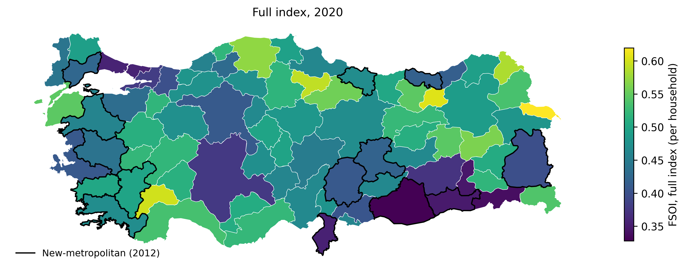
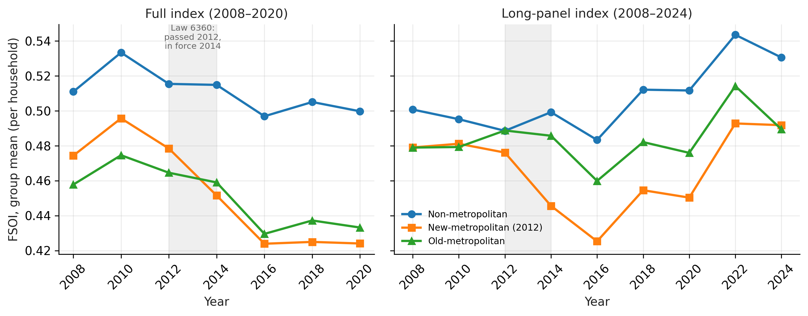

# 5. How Food Sovereignty Is Distributed

<!--
WORKING DRAFT v2 (rebuilt 13-indicator full index), agent-written for Orhan to rewrite.
Markers: [INT] interpretation · [CITE: x] citation to supply · [VERIFY] fact to check.
Numbers: writing_drafts/scripts/descriptive_tables.py on the rebuilt export (rerun 2026-10-02),
except TOPSIS and flat weighting (econometrics notebook). Ledger rows C1–C15.
The animal-product material moved to appendix_B_animal_products.md.
-->

This chapter describes the Food Sovereignty Index as it stands: how scores are spread across
provinces, how the three groups of provinces compare, and how scores changed over time. It is
descriptive. Differences between groups here are not estimates of the effect of Law 6360; that
question is taken up in Chapter 6 with a design built for it. Unless stated otherwise, the
chapter uses the full index (five categories, 13 indicators, 2008–2020) with the primary
specification: per household, equal category weights, cost framing (Table 4.3).

## 5.1 The distribution across provinces

In 2020 the average province scored 0.486 on the full index. Scores ranged from 0.351 (Şırnak)
to 0.628 (Iğdır), with a standard deviation of 0.065. The spread was stable over the period: the
standard deviation stayed between 0.060 and 0.068 in every panel year.

**Figure 5.1.** Full-index scores by province, 2020. New-metropolitan provinces are outlined.
*Source:* TÜİK, Ministry of Agriculture and Forestry; boundaries: HDX `cod-ab-tur` (Harita
Genel Müdürlüğü), CC BY-IGO; author's calculations.

**The top of the distribution.** Nine of the ten highest-scoring provinces in 2020 are
non-metropolitan: Iğdır, Amasya, Burdur, Bayburt, Kastamonu, Tokat, Muş, Çanakkale and Ardahan.
The tenth is Antalya, an old-metropolitan province with Türkiye's largest greenhouse sector.
[INT] Most of the nine are small, predominantly rural provinces where agriculture carries a large
share of household life and municipal service loads per household are light.

**The bottom of the distribution** is mixed: four old-metropolitan provinces (Konya, Diyarbakır,
Kocaeli, İstanbul), three new-metropolitan provinces (Hatay, Mardin, Şanlıurfa) and three
non-metropolitan provinces (Yalova, Batman, Şırnak). The category scores show that provinces
reach the bottom by opposite routes (Table 5.1).

**Table 5.1.** Category scores of the ten lowest-scoring provinces, full index, 2020.

| Province | Production | Land use | Market | External input | Municipal burden | FSOI |
|---|---:|---:|---:|---:|---:|---:|
| Konya | 0.451 | 0.336 | 0.573 | 0.063 | 0.547 | 0.394 |
| Yalova | 0.057 | 0.237 | 0.121 | 0.963 | 0.545 | 0.385 |
| Diyarbakır | 0.262 | 0.317 | 0.481 | 0.405 | 0.457 | 0.384 |
| Kocaeli | 0.084 | 0.216 | 0.066 | 0.970 | 0.578 | 0.383 |
| Hatay | 0.195 | 0.318 | 0.266 | 0.601 | 0.467 | 0.369 |
| Mardin | 0.296 | 0.382 | 0.455 | 0.126 | 0.570 | 0.366 |
| Şanlıurfa | 0.346 | 0.373 | 0.604 | 0.000 | 0.471 | 0.359 |
| İstanbul | 0.007 | 0.201 | 0.000 | 0.994 | 0.577 | 0.356 |
| Batman | 0.183 | 0.285 | 0.354 | 0.655 | 0.280 | 0.352 |
| Şırnak | 0.214 | 0.272 | 0.394 | 0.687 | 0.188 | 0.351 |
| *Median, all provinces* | *0.298* | *0.314* | *0.394* | *0.790* | *0.688* | *0.484* |

*Note.* Higher scores mean more food sovereignty in every column; cost indicators are already
reversed. *Source:* computed from the full-index export.

The first route is urbanization. İstanbul, Kocaeli and Yalova produce very little per household
and realize little market value, but they also use few purchased agricultural inputs, so they
score near the top on external input. The second route is intensive agriculture. Konya,
Şanlıurfa and Mardin produce and earn above the national median, yet score near zero on external
input, because their agriculture depends heavily on fertilizer and electricity. [VERIFY:
irrigation as the main driver of agricultural electricity in Konya and Şanlıurfa] A third
pattern appears in Şırnak and Batman, where low production is combined with a low municipal
burden score.

[INT] These opposite routes illustrate the averaging limitation discussed in Section 4.2.4: the
same low score can hide very different profiles, which is why category scores are reported
alongside the composite. They also show the index working as its framing intends. Two of
Türkiye's most productive agricultural provinces, Konya and Şanlıurfa, score low not because
they produce little, but because their production depends on purchased inputs. A food security
index would rank them high; the FSOI ranks them low because dependence counts against
sovereignty.

**The other side of the same limitation: Hakkari.** Hakkari ranks 14th of 81 in 2020, and
between 6th and 21st in every panel year. It reaches these ranks through external input: it has
the highest external-input score of all provinces in six of the seven years, because it reports
almost no fertilizer use in every year for which it reports at all. Its production and land-use
scores, by contrast, are low (around 0.2–0.3 and 0.3). [INT] Hakkari is mountainous and has little crop
agriculture, so its low input use reflects how little it farms, not how independently it farms.
Low dependence on inputs indicates sovereignty only where there is agriculture to depend on them.
The index cannot tell these two situations apart, and Chapter 8 returns to what this means for
the concept.

## 5.2 The three groups of provinces

Table 5.2 shows the average full-index score of each group of provinces over time, with the
national aggregate for reference.

**Table 5.2.** Mean full-index score by group of provinces, 2008–2020.

| Year | Non-metropolitan (51) | Old-metropolitan (16) | New-metropolitan (14) | Türkiye (aggregate) |
|---|---:|---:|---:|---:|
| 2008 | 0.516 | 0.463 | 0.482 | 0.484 |
| 2010 | 0.534 | 0.479 | 0.500 | 0.500 |
| 2012 | 0.529 | 0.481 | 0.497 | 0.499 |
| 2014 | 0.526 | 0.472 | 0.464 | 0.487 |
| 2016 | 0.510 | 0.444 | 0.439 | 0.463 |
| 2018 | 0.518 | 0.451 | 0.440 | 0.468 |
| 2020 | 0.511 | 0.446 | 0.439 | 0.461 |

*Note.* Unweighted means across provinces in each group. The national aggregate is Türkiye's own
score on the same scale, not the mean of the provinces. *Source:* computed from the full-index
export.

**Figure 5.2.** Mean index score by group of provinces over time, full index (2008–2020) and
long-panel index (2008–2024). The shaded band marks Law 6360, passed in 2012 and in force from
2014. *Source:* author's calculations.

**Which result is robust.** Under the primary specification, non-metropolitan provinces score
highest in every year. This ordering depends on the aggregation method: under TOPSIS,
old-metropolitan provinces lead in 2020, although narrowly (0.322 against 0.318). Which of these
two groups ranks highest is therefore not a finding about the provinces. New-metropolitan
provinces are the lowest group in every 2020 view (equal weights 0.439, equal indicator weights
0.412, TOPSIS 0.289) and in every view of the long-panel index. Averaged over all years from 2008
to 2020, however, old-metropolitan provinces are marginally lower (0.462 against 0.466 with equal
category weights; by 0.010 with equal indicator weights).

**A change in position around the reform.** Before Law 6360, new-metropolitan provinces scored
above old-metropolitan provinces in every panel year (0.497 against 0.481 in 2012). From 2014
onward they scored below them (0.464 against 0.472 in 2014, 0.439 against 0.446 in 2020). [INT]
The timing coincides with the reform, but a descriptive comparison cannot say whether the reform
caused it. The old-metropolitan provinces were themselves affected by the same law, which
extended metropolitan boundaries in their provinces as well, and the groups differ in many ways
besides their status. Chapter 6 tests the question with a difference-in-differences design
against non-metropolitan provinces.

**Where the group differences come from.** Table 5.3 breaks the 2020 group means into their
categories.

**Table 5.3.** Mean category scores by group, full index, 2020.

| Group | Production | Land use | Market | External input | Municipal burden | FSOI |
|---|---:|---:|---:|---:|---:|---:|
| Non-metropolitan | 0.303 | 0.318 | 0.439 | 0.751 | 0.744 | 0.511 |
| Old-metropolitan | 0.290 | 0.310 | 0.312 | 0.755 | 0.563 | 0.446 |
| New-metropolitan | 0.266 | 0.323 | 0.375 | 0.694 | 0.536 | 0.439 |

*Source:* computed from the full-index export.

Production and land use differ little between the groups; the largest gap in either is 0.037.
The groups separate mainly on two categories. On municipal burden, non-metropolitan provinces
score about 0.2 higher than both metropolitan groups, meaning lighter measured municipal service
loads per household. On market, non-metropolitan provinces score highest and old-metropolitan
provinces lowest. [INT] The municipal burden gap is the one to watch: the metropolitan groups are
exactly the provinces whose municipal boundaries Law 6360 redrew, and Chapter 6 shows that this
category carries the reform's measurable effect.

## 5.3 Change over time

Across all provinces, the mean full-index score fell slightly, from 0.499 in 2008 to 0.486 in
2020, and about two-thirds of provinces (65%) ended the period lower than they started. Table 5.4
shows where the change comes from.

**Table 5.4.** Mean category scores across provinces, full index, 2008–2020.

| Year | Production | Land use | Market | External input | Municipal burden | FSOI |
|---|---:|---:|---:|---:|---:|---:|
| 2008 | 0.266 | 0.337 | 0.492 | 0.790 | 0.612 | 0.499 |
| 2012 | 0.280 | 0.327 | 0.534 | 0.774 | 0.656 | 0.514 |
| 2016 | 0.282 | 0.318 | 0.433 | 0.742 | 0.648 | 0.485 |
| 2020 | 0.294 | 0.317 | 0.403 | 0.742 | 0.672 | 0.486 |
| Contribution to the 2008–2020 change | +0.006 | −0.004 | −0.018 | −0.010 | +0.012 | −0.014 |

*Note.* The contribution of a category is its change divided by five, since each category is
one-fifth of the index; contributions sum to the change in the FSOI. *Source:* computed from the
full-index export.

The decline is driven by the market category, which fell from 0.492 to 0.403. Production
measured in tons rose over the same period, and the municipal burden score rose, meaning that
measured municipal service load per household fell. Market values are converted to US dollars,
and the lira depreciated steeply against the dollar over these years [CITE: Central Bank of the
Republic of Türkiye exchange-rate series]. When market values are instead expressed relative to
the national total in each year, which removes the currency, the change in the mean FSOI becomes
slightly positive (+0.004; Appendix B). [INT] The decline is therefore a fall in the dollar value
of agricultural output, not a decline in food sovereignty.

The long-panel index, which has no market category, shows no robust national trend either. Its
direction depends on the denominator. Per household, the provincial mean drifts slightly upward
(from 0.493 in 2008 to 0.516 in 2024; +0.002 per year, p < 0.001). Per capita, it drifts slightly
downward (−0.001 per year, p = 0.051), on a version of the index with all four categories
rebuilt per capita (harvested land per capita stands in for core cultivated land, which is
measured the same way). The difference comes from municipal burden. Nationally,
waste collected grew by 32.5% between 2008 and 2024 and population by 19.8%, so waste per person
rose by 10.6%. But the number of households grew by 54.6%, as households became smaller (from
4.0 to 3.1 persons), so waste per household fell by 14.3%. Because waste is a cost indicator, the
per-household score rises and the per-capita score falls.

[INT] Neither index, then, shows a real national trend in food sovereignty over this period. The
full index falls because of the dollar; the long-panel index drifts slightly up per household
because households shrink, and slightly down per capita because waste per person rises.

[INT — you decide whether to mention the preliminary study: an earlier, preliminary version of
this research reported a national loss of food sovereignty after 2012. It used an index that
included dollar-valued output and a series with a coverage break (Appendix B), which can produce
such a decline. The two indices are built differently and cannot be compared directly.]

**Provinces keep their relative positions.** The rank order of provinces in 2020 is close to
that of 2008 (rank correlation 0.79). Movements in the index are mostly shared across provinces
rather than reshuffling them.

## 5.4 Summary

Food sovereignty, as the FSOI measures it, is highest in small, rural non-metropolitan provinces
and lowest in two very different kinds of province: urban-industrial provinces that produce
little, and intensive agricultural provinces whose production depends on purchased inputs. The
case of Hakkari shows the reverse limitation: low input use can reflect little agriculture rather
than independence. New-metropolitan provinces are the lowest group in every 2020 view and moved
from above to below old-metropolitan provinces at the time of Law 6360, while which of the other
two groups ranks highest depends on the aggregation method. The main differences between groups
lie in municipal burden and market value, not in production or land use. Over time, the full
index declines slightly, but only through the dollar value of market output, and the long-panel
index has no robust trend: its direction depends on whether it is measured per household or per
person. Neither shows a real national trend in food sovereignty. These are descriptive
patterns. Chapter 6 asks which of them, if any, can be attributed to Law 6360.

---

## Suggested citations for Chapter 5

- Central Bank of the Republic of Türkiye (TCMB), exchange-rate series (EVDS), for the lira's
  depreciation. Data source, not literature.
- No new literature is needed; Chapter 5 cites Chapter 4 for methods.
