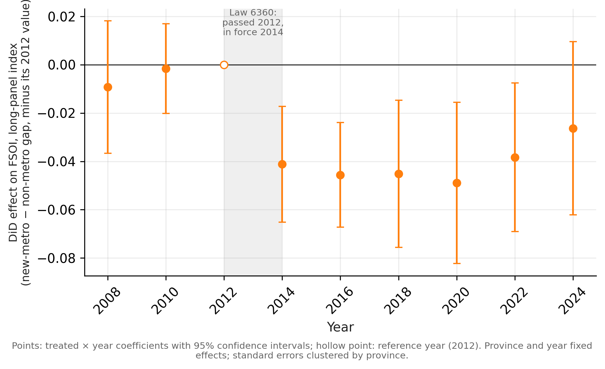
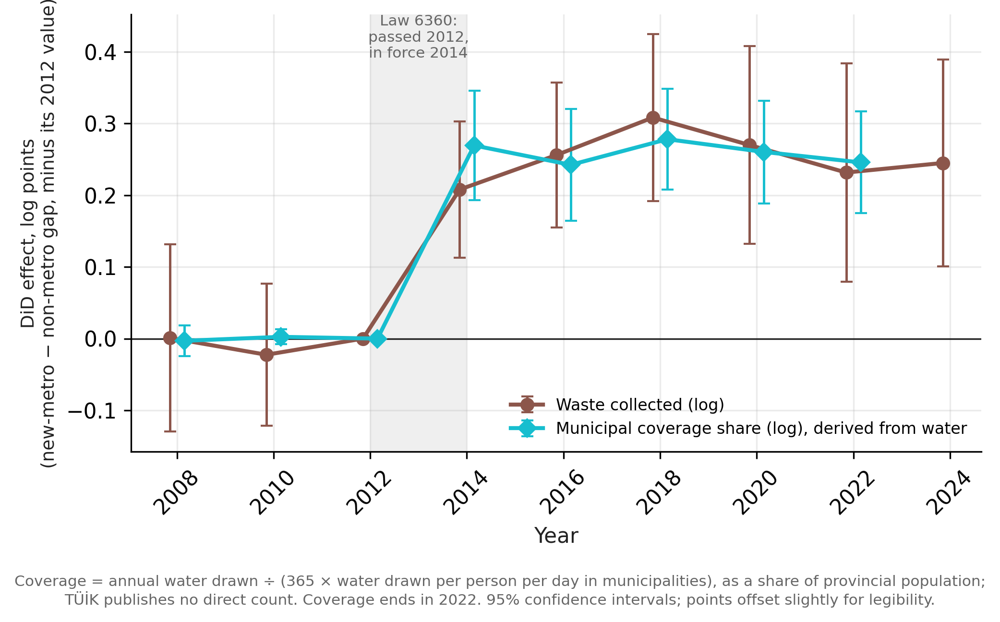
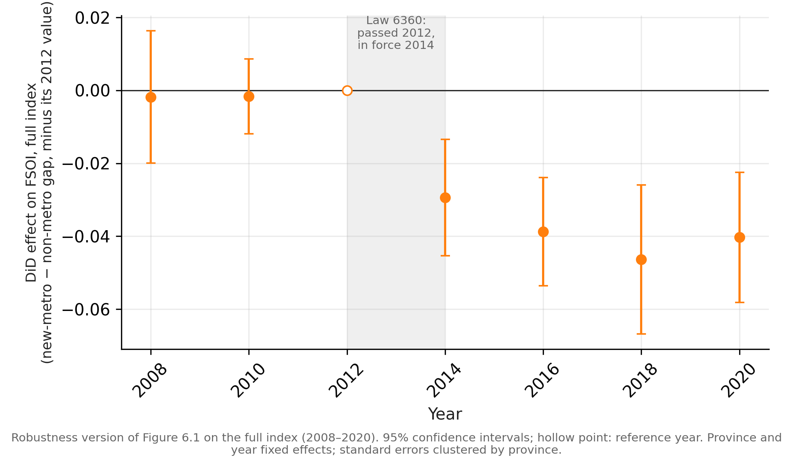

# 6. Did Law 6360 Change the FSOI?

<!--
WORKING DRAFT v1, agent-written for Orhan to rewrite. Markers as in Chapter 4:
  [INT] interpretation · [CITE: x] citation to supply · [VERIFY] fact to check · [FIGURE] to produce
Numbers: claims_ledger.md section D and E; all computed in
econometric_models_and_vars/fsoi_indicator_selection.ipynb (sections: DiD, LOCO, robustness,
"Denominator decomposition", "Size-matched", "Update 2026-10-01").
Decision (Orhan, 2026-10-01): municipal burden stays in the index; the chapter leads with the
category decomposition. Study aid: writing_drafts/did_walkthrough.md.
-->

This chapter tests the hypothesis set out in Chapter 1: that Law 6360 reduced food sovereignty
in the provinces it turned into metropolitan municipalities. Chapter 5 showed that
new-metropolitan provinces score lowest among the three groups in 2020 and moved from above to below
old-metropolitan provinces around the time of the reform. Those patterns are descriptive. This
chapter asks whether they can be attributed to the law.

The answer has three parts. The FSOI of new-metropolitan provinces fell after the reform
relative to comparable provinces, by 0.037 points on the long-panel index. The whole of that
fall comes from one category, municipal burden; agricultural production shows no detectable
change. And the change in municipal burden reflects an expansion of municipal service coverage:
after the reform, municipal statistics counted more people, not more waste per person. The
sections below set out the design (6.1), the main estimate (6.2), the decomposition by category
(6.3), the mechanism (6.4), the robustness checks (6.5) and the limits of the design (6.6),
before returning to the hypothesis (6.7).

## 6.1 Design

### 6.1.1 The comparison

The effect of a law on the provinces it affected is the difference between what happened to
them and what would have happened without the law. The second quantity cannot be observed. Two
simple substitutes both fail. Comparing new-metropolitan provinces before and after 2014 mixes
the law with everything else that changed nationally over the period, such as the depreciation
of the lira, national agricultural policy and, in 2020, the COVID-19 pandemic. Comparing
new-metropolitan provinces with other provinces after 2014 mixes the law with differences that
existed before it: new-metropolitan provinces were larger and more urban long before 2012.

A difference-in-differences design combines the two comparisons [CITE: DiD textbook, e.g.
Angrist & Pischke 2009 or Cunningham 2021]. It uses the change over time in a comparison group
as the estimate of how the affected provinces would have changed without the law. The effect is
the difference between the two changes: how much more, or less, the FSOI of new-metropolitan
provinces changed after the reform than that of the comparison provinces over the same years.
Anything that affected both groups equally, such as the lira or the pandemic, cancels out.

### 6.1.2 Treatment and comparison groups

The treated group is the 14 provinces that became metropolitan municipalities in 2012–2013:
13 under Law 6360 and Ordu under Law 6447 [VERIFY: ledger A4]. The law was passed in 2012 and
took effect with the local elections of March 2014, so in this biennial panel 2008, 2010 and
2012 are the years before the reform and 2014–2024 the years after it.

The comparison group is the 51 non-metropolitan provinces. Old-metropolitan provinces are not
used as a comparison, for a reason specific to this law. Law 6360 did not only create new
metropolitan municipalities; it also extended the boundaries of the existing ones to cover their
whole province. Between 2012 and 2014, the share of the provincial population covered by
municipal services rose by 0.226 in new-metropolitan provinces (from about 73% to 96%), by
0.089 in old-metropolitan provinces (from about 90% to 99%), and fell by 0.020 in
non-metropolitan provinces. Old-metropolitan provinces were therefore partly treated
themselves, and a comparison with them would understate any effect working through municipal
services. Non-metropolitan provinces, whose status did not change, are the only clean
comparison.

### 6.1.3 The model

The estimate comes from a two-way fixed-effects regression:

$$
\text{FSOI}_{it} = \alpha_i + \lambda_t + \beta \,(\text{NewMetro}_i \times \text{Post}_t) + \varepsilon_{it}
$$

where $\alpha_i$ is a fixed effect for each province, $\lambda_t$ a fixed effect for each year,
$\text{NewMetro}_i$ equals 1 for the 14 treated provinces, and $\text{Post}_t$ equals 1 from
2014 onward. Province fixed effects absorb everything about a province that does not change over
time, such as its size, climate or position. Year fixed effects absorb everything that affects
all provinces in the same year. The coefficient $\beta$ is the difference-in-differences
estimate.

The outcome is the **long-panel index** (four categories, 2008–2024; Section 4.3.1), with the
primary specification: per household, equal category weights, cost framing. The long-panel index
is used because it has six time points after the reform, against four in the full index, one
of which (2020) is the first year of the pandemic (Section 4.3.1). The sample is 65 provinces observed in 9 years, 585 province-years.

### 6.1.4 Inference

Observations of the same province in different years are not independent, so standard errors
are clustered by province. With only 14 treated provinces, conventional clustered standard
errors can understate uncertainty [CITE: Cameron, Gelbach & Miller 2008, or a review of
inference with few treated clusters]. I therefore also report p-values from a wild cluster
bootstrap (Rademacher weights, 999 replications, imposing the null hypothesis), which is
designed for this situation.

### 6.1.5 The identifying assumption

The design rests on one assumption: without the law, new-metropolitan and non-metropolitan
provinces would have changed in parallel. They may differ in level; what matters is that they
would have changed at the same pace. This "parallel trends" assumption concerns a world that
cannot be observed, so it cannot be proven. It can be checked in part, by asking whether the two
groups moved in parallel before the reform. With three pre-reform time points, that check is
weak, and Section 6.6 returns to it.

## 6.2 The main estimate

Relative to non-metropolitan provinces, the long-panel FSOI of new-metropolitan provinces fell by
**0.037** points after the reform (standard error 0.013; 95% CI −0.062 to −0.012; p = 0.003).
The wild cluster bootstrap gives p = 0.004, so the result is not an artifact of the small number
of treated provinces. The size of the effect is modest: it corresponds to about half a standard
deviation of the FSOI across provinces [VERIFY: SD of the long-panel FSOI across provinces, to
express −0.037 in SD units].

The same design applied to the full index, with five categories instead of four and 2008–2020
instead of 2008–2024, gives almost exactly the same estimate: −0.0375 against −0.0373. Both have
clean pre-reform differences, and both remain significant under the wild cluster bootstrap
(Section 6.5). [INT] That two indices built from different sets of categories over different
periods agree to the third decimal is the strongest single robustness result in this chapter.

**Figure 6.1.** Event study of the long-panel FSOI. Each point is the gap between new-metropolitan
and non-metropolitan provinces in that year, minus the same gap in 2012, with 95% confidence
intervals. A negative value means new-metropolitan provinces fell behind relative to 2012. *Source:*
author's calculations; coefficients in `thesis_outputs/table_6_1_event_study_long_panel.csv`.

An event study, which estimates the difference separately for each year, shows the timing
(Figure 6.1). Before the reform, the differences in 2008 (−0.009) and 2010 (−0.002) relative to
2012 are close to zero, consistent with parallel trends. After the reform, the difference
appears at once in 2014 (−0.041) and stays between −0.045 and −0.049 through 2020. It then
weakens: −0.038 in 2022 (p = 0.015) and −0.026 in 2024, when it is no longer statistically
significant (p = 0.15). Section 6.4 explains why the effect weakens even though the underlying
change does not.

Taken at face value, this would support the hypothesis. The rest of the chapter shows why it
should not be taken at face value.

## 6.3 Where the effect comes from

The FSOI averages four categories in the long-panel index. To see which of them carries the
effect, I estimated the same model on each category separately, and on the index with each
category removed in turn. Table 6.1 shows the first set of results.

**Table 6.1.** Difference-in-differences estimates by category, long-panel index.

| Category (indicators in the long-panel index) | Estimate | p | Reading |
|---|---:|---:|---|
| Municipal burden (waste collected) | −0.175 | < 0.001 | large, worse for new-metropolitan provinces |
| Land use (five land indicators) | −0.023 | 0.003 | small, worse |
| External input (fertilizer) | +0.048 | 0.004 | small, better |
| Production (crop and greenhouse tons) | −0.0002 (95% CI −0.022 to +0.022) | 0.98 | no detectable change |
| *FSOI (all four)* | *−0.037* | *0.003* | |
| *FSOI without municipal burden* | *+0.009* | *0.22* | *no detectable change* |

*Note.* Each row is a separate regression with the same specification as Section 6.2. Scores are
cost-framed: a negative estimate means the category score fell, that is, the measured quantity
moved in the direction counted against sovereignty.

The pattern is clear. Municipal burden moves by −0.175, an order of magnitude more than any other
category. Without it, the FSOI estimate is +0.009 and not distinguishable from zero. **The whole
effect on the composite comes from municipal burden.**

The other three categories need to be described precisely rather than summarized as "no
effect". Production shows no detectable change, and the interval is tight: it rules out effects
larger than about 0.022 in either direction, which is about 0.18 standard deviations of the
production score and an eighth of the municipal burden estimate. Land use and external input do
move, but by small amounts and in opposite directions: the land-use score fell slightly in
new-metropolitan provinces, while the external-input score rose, meaning that measured
fertilizer use per household fell relative to non-metropolitan provinces. Averaged together, these
two small effects largely cancel, which is why removing municipal burden leaves an estimate
near zero. [INT] Neither is large enough to change the reading of the composite, and their
opposite signs give no consistent picture of the reform's effect on agriculture.

The land-use effect is worth a closer look, because critics of Law 6360, among them the Chamber
of Agricultural Engineers (ZMO), argue that it weakened village control over land (Chapter 7). Broken down by indicator, the −0.023 is spread
thinly: fallow land −0.011 (more fallow in new-metropolitan provinces; the only indicator
significant on its own, p = 0.021), vegetable land −0.007, long-term crops −0.004, greenhouse
land −0.002, and core cultivated land +0.001. Estimated on the raw areas in logarithms, none of
these changes is statistically significant (fallow +26%, p = 0.31; vegetable land −11%, p = 0.24;
harvested area −3%, p = 0.67). [INT] There is therefore no evidence of farmland loss in the
provincial data. The small land-use effect is a diffuse shift toward fallow and away from
vegetable land, too weak on its own to support the argument that the reform cost villages their
land; that argument remains a claim made by critics of the law, discussed in Chapter 8, not a
result of this analysis.

Recall that in the long-panel index, municipal burden is measured by a single indicator, waste
collected per household, which carries a quarter of the index on its own (Section 4.2.4). The
question then becomes what the change in waste collection represents.

## 6.4 Mechanism: the expansion of municipal coverage

A fall in the municipal burden score means that waste collected per household rose faster in
new-metropolitan provinces than in non-metropolitan ones. That could happen in three ways:
households produced more waste, the number of households changed, or municipalities began
collecting waste from people they had not served before. Normalized scores cannot separate these,
so I re-estimated the model on the logarithms of the raw quantities. In logs, a ratio becomes a
difference, so the change in waste per household splits exactly into the change in waste and the
change in the number of households.

**Table 6.2.** Difference-in-differences estimates on raw quantities (natural logarithms),
new-metropolitan vs. non-metropolitan provinces.

| Quantity | Estimate (log points) | Approximate % change | p |
|---|---:|---:|---:|
| Waste collected (total) | +0.260 | +30% | < 0.001 |
| Waste collected per household | | +27% | < 0.05 |
| Waste collected per person | | +23% | < 0.05 |
| Number of households | | +2% | 0.37 |
| Mean household size | | +3% | 0.21 |
| Municipal coverage share | +0.259 | +30% | [VERIFY] |

*Note.* The municipal coverage share is the proportion of the provincial population counted as
living in municipalities. There is no direct count of it; it is derived from TÜİK's drinking-water
statistics, as the annual volume of water drawn divided by 365 times the published daily volume
per person in municipalities, which gives the population TÜİK counted as municipal, expressed as
a share of the provincial population. It is therefore measured independently of waste, but not
independently of water. [VERIFY: log-point estimates and p-values for the per-household,
per-person, household and household-size rows; and the p-value for coverage]

The change is in the numerator. Total waste collected rose by about 30% more in new-metropolitan
provinces, while the number of households and their size did not change detectably. And the
coverage share rose by almost exactly the same amount as waste: +0.259 against +0.260 log
points, a ratio of 1.00, with the same year-by-year path (Figure 6.2).

**Figure 6.2.** Event study of waste collected and of the municipal coverage share (natural
logarithms). Each point is the gap between new-metropolitan and non-metropolitan provinces in
that year, minus the same gap in 2012, with 95% confidence intervals. The coverage share is derived from TÜİK water statistics (see the note to
Table 6.2). *Source:* author's calculations; coefficients in
`thesis_outputs/table_6_2_event_study_waste_coverage.csv`.

**Why the composite effect weakens after 2020.** Comparing the waiver years (2014–2018) with all
post-waiver years (2020–2024), the waste effect is stable in percentage terms: in logs it falls
only from 0.257 to 0.249, about 3%. The composite effect weakens by 14% over the same windows,
for a mechanical reason. Waste per household is a very small number, and at that scale the
log(1 + x) step of the normalization is effectively linear (Section 4.2.3), so municipal burden is
scored on a raw, not a percentage, scale. As waste per household declined over the period in all
provinces, the same percentage gap became a smaller absolute gap in scores, and the
municipal-burden score effect shrank by 27%. This alone more than accounts for the composite's
fade; production and land use, drifting slightly further negative, partly offset it.
[INT] The fade is therefore a property of the scale, not evidence that the coverage change was
reversed.

[INT] The simplest reading is that municipalities did not collect more waste per person they
served; they served more people. Law 6360 turned villages into neighborhoods of metropolitan
municipalities, and the people living there entered municipal waste collection and municipal
statistics. Waste per covered resident did not change. The reform's clearest statistical
footprint is therefore the **extension of municipal service coverage**: an administrative change
in who is counted and served, not a change in household burden, and not a change in
agricultural production.

This is the same mechanism that removed TÜİK's per-person water series from the index
(Section 4.1.4): municipal statistics changed their population base with the reform. It also
qualifies what "municipal burden" measures after 2014. [INT] The category was meant to capture
the service load on households; in this period it mostly captures the reach of municipal
services.

**An alternative reading: the tariff waiver.** Part of the municipal-burden effect could instead
reflect Law 6360's transitional provision, which for five years (2014–2019) waived taxes and fees
for villages converted to neighborhoods and capped their drinking- and usage-water tariffs at a
quarter of the lowest municipal tariff [CITE: Çelikyay 2014; VERIFY against the law]. If the cap
drove the effect, the effect should weaken once the cap ended. In logs, the effect on waste
collected is stable: 0.257 on average over 2014–2018 against 0.249 over 2020–2024, a 3% decline,
which is what a permanent extension of municipal coverage predicts, not a price effect. For
water, the variable the provision targeted, the effect declines by 23% between 2014–2018 and
2020–2022, the last year water is published, so a contribution of the tariff cap to water cannot
be ruled out. It cannot be tested cleanly, because the coverage measure is itself derived from
water statistics, and 2020 coincides with the COVID-19 pandemic.

## 6.5 Robustness

Table 6.3 reports the main estimate under alternative choices. Each row answers a specific
objection.

**Table 6.3.** The difference-in-differences estimate under alternative specifications.

| Specification | Objection it addresses | Estimate | Bootstrap p | Without municipal burden |
|---|---|---:|---:|---:|
| Primary | | −0.037 | 0.004 | +0.009 (p = 0.22) |
| Equal indicator weights | waste carries too much weight | −0.027 | 0.002 | −0.008 (p = 0.17) |
| TOPSIS aggregation | the result depends on averaging | −0.025 | 0.005 | −0.0003 (p = 0.97) |
| Per-capita denominator | the household denominator drives it | −0.037 | 0.007 | |
| Waiver years excluded (2014–2018) | the tariff waiver drives it | −0.034 | 0.025 | +0.003 (p = 0.75) |
| Largest 14 non-metropolitan provinces as controls | treated provinces are just larger | −0.035 | 0.016 | |
| Data-quality outlier provinces dropped | a few provinces' data drive it | −0.037 | | |
| Full index (5 categories, 2008–2020) | the result depends on which index is used | −0.038 | < 0.001 | |

*Note.* Same model and sample as Section 6.2 unless stated. "Without municipal burden" re-estimates
the specification on the index without that category. Empty cells: not computed. [VERIFY: the
outlier-provinces row (which provinces, and its p-value); the per-capita estimate is −0.0369]

The estimate is negative and statistically significant in every specification, and in every
specification where it was checked, removing municipal burden removes the effect. Bootstrap
p-values from 999 replications carry a simulation error of about ±0.005, which does not affect
any of these conclusions. Three checks
deserve comment.

**Benefit framing.** If the cost indicators are not reversed, the estimate becomes +0.031
(p = 0.008). This is not a contradiction: under benefit framing more waste per household counts
as more sovereignty, so the sign must flip. It confirms that the sign follows from the framing
convention, not from the data.

**Per area.** On the per-area version of the index, the estimate is −0.0003 (p = 0.95), which
looks like no effect. It is not. Min-max scaling across all province-years spreads per-area
values according to population density, which differs about 288-fold between provinces, and
leaves almost no room for change within a province: only 0.9% of the variance of the per-area
waste score lies within provinces, against 34% for the per-household score. The municipal burden
coefficient shrinks by the same factor (about 11-fold), and municipal burden alone remains
significant on the per-area index (−0.016, p < 0.001). [INT] The normalized per-area index is
therefore not usable for this design; the null is an artifact of scaling, not evidence against
the effect.

**The full index.** Estimated on the full index, with all five categories but only four
post-reform time points (2014–2020, n = 455), the effect is almost identical: −0.0375 (standard
error 0.0069, p < 0.001; wild cluster bootstrap p < 0.001), against −0.0373 on the long-panel
index. The event study has the same shape: pre-reform differences of −0.002 in both 2008 and
2010, then −0.029, −0.039, −0.046 and −0.040 in 2014–2020 (Figure 6.3). In the full index
municipal burden combines water and waste, so the same coverage reading applies.

**Figure 6.3.** Event study of the full FSOI (five categories, 2008–2020). Each point is the gap
between new-metropolitan and non-metropolitan provinces in that year, minus the same gap in
2012, with 95% confidence intervals. *Source:* author's calculations; coefficients in
`thesis_outputs/table_6_1b_event_study_full_index.csv`.

**Size.** Metropolitan status under Law 6360 followed a population threshold, so treated
provinces are larger than almost all non-metropolitan provinces. Restricting the comparison
group to the 14 largest non-metropolitan provinces narrows the size gap (the median ratio falls
from 3.02 to 1.76) and leaves the estimate essentially unchanged (−0.035), with the coverage
decomposition intact (ratio 1.06). The gap cannot be closed entirely: the largest
non-metropolitan province (Afyonkarahisar, about 704,000 people in 2012) is still smaller than
the smallest new-metropolitan province (Ordu, about 741,000). A comparison group that overlaps
the treated group in size does not exist, because the law drew the line by size.

## 6.6 Limits of the design

Five limits remain, and they should be read with the results.

1. **Three pre-reform time points.** Parallel trends can be checked only on 2008, 2010 and 2012.
   The check passes, but it is a weak check.
2. **A small difference in population growth.** Population grew about 5% faster in
   new-metropolitan provinces (0.051 log points), with one significant pre-reform difference
   (2008: −0.027, p = 0.004). This is small next to the 30% coverage change, but it means the
   groups were not identical in their trends. [VERIFY: sign convention of the 2008 coefficient]
3. **No size overlap.** As Section 6.5 showed, the treated and comparison provinces never
   overlap in size.
4. **The province is coarser than the reform.** Law 6360 acted on villages and districts, by
   abolishing the legal personality of villages (*köy tüzel kişiliği*) and of provincial special
   administrations. Province-level totals can dilute effects that are concentrated in particular
   villages or among particular producers, such as smallholders.
5. **2020 and the tariff waiver.** The first post-waiver year coincides with the pandemic. For
   waste the waiver reading is not supported (Section 6.4), but for water a contribution of the
   tariff cap cannot be ruled out.

## 6.7 The hypothesis

The hypothesis was that Law 6360 reduced food sovereignty in the provinces it made metropolitan.

[INT — Orhan, this paragraph is your verdict; rewrite it in your own words.] The composite index
fell in new-metropolitan provinces after the reform, and the fall is statistically robust. But
the fall comes entirely from municipal burden, and municipal burden changed because municipal
coverage expanded: the reform extended the reach of municipal services and statistics to the
former villages, one for one. The measured agricultural components show no consistent change.
Production shows no detectable change, with an interval tight enough to rule out effects larger
than about 0.02 points, and the small changes in land use and external input point in opposite
directions. The evidence therefore does not support the hypothesis that Law 6360 reduced food
sovereignty as the FSOI measures it. It shows instead that the reform changed how the state's
municipal statistics see these provinces.

Two cautions travel with this conclusion. It is a statement about the material base of food
sovereignty measured at the province level (Section 4.3.2), not about control over land, seeds
or decisions, which the index cannot see. And it is not proof that the reform had no effect on
agriculture: effects in particular villages, or among small producers, could be too small or too
local to appear in provincial totals.

## 6.8 Summary

Using a difference-in-differences design that compares the 14 new-metropolitan provinces with 51
non-metropolitan provinces over 2008–2024, this chapter found that the long-panel FSOI of
new-metropolitan provinces fell by 0.037 points after Law 6360. The full index gives the same
estimate (−0.0375), and the result holds under every alternative specification tried. Decomposition shows that the entire effect comes from municipal
burden, and the raw data show that waste collection rose exactly as much as municipal coverage
did. The law's measurable footprint is the extension of municipal services, not a change in
agricultural production, which shows no detectable change. Chapter 7 turns from what the state's
statistics register to what the state says, and finds a parallel pattern: the state treated the
reform as a municipal matter, not an agricultural one.

---

## Suggested citations for Chapter 6

| Cited as | Reference | Status | Used in |
|---|---|---|---|
| DiD textbook | Angrist, J. D., & Pischke, J.-S. (2009). *Mostly harmless econometrics: An empiricist's companion*. Princeton University Press. **or** Cunningham, S. (2021). *Causal inference: The mixtape*. Yale University Press. | new | 6.1.1 |
| Few clusters | Cameron, A. C., Gelbach, J. B., & Miller, D. L. (2008). Bootstrap-based improvements for inference with clustered errors. *The Review of Economics and Statistics, 90*(3), 414–427. | new | 6.1.4 |
| Number of bootstrap draws (optional) | Davidson, R., & MacKinnon, J. G. (2000). Bootstrap tests: How many bootstraps? *Econometric Reviews, 19*(1), 55–68. | new, optional; verify against the paper | 6.1.4 (choice of 999 draws) |
| Çelikyay 2014 | Çelikyay, H. H. (2014). *Değişen kent yönetimi ve 6360 sayılı Büyükşehir Yasası* (SETA Analiz No. 101). SETA. | new, verify author initials | 6.4 |
| Law 6360 | 6360 sayılı On Üç İlde Büyükşehir Belediyesi ve Yirmi Altı İlçe Kurulması ile Bazı Kanun ve Kanun Hükmünde Kararnamelerde Değişiklik Yapılmasına Dair Kanun. *Resmî Gazete*, 6 December 2012, No. 28489. | primary source, verify | 6.1.2, 6.4 |

Optional, if a jury member asks about staggered treatment or modern DiD estimators: the
treatment here happens at one date for all treated provinces, so the recent literature on
staggered adoption does not apply. Worth one sentence if asked; not needed in the text.

## Checks pending

- `[VERIFY]` items: Table 6.2 per-household / per-person / household rows; the coverage p-value;
  the outlier-provinces row; SD units for −0.037; the 2008 population coefficient sign; ledger
  A4 (13 + Ordu); the waiver details against the law.
